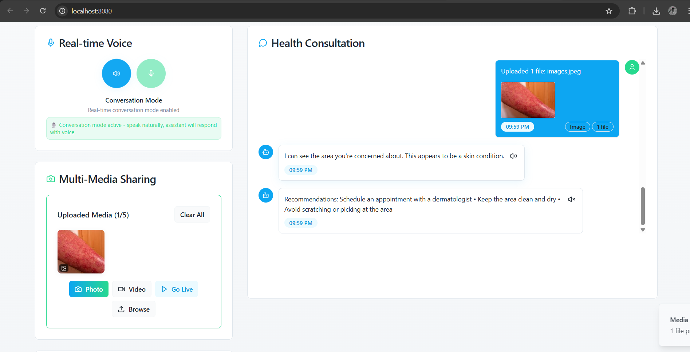

# Voice Health Buddy AI

A full-stack AI-powered assistant for analyzing symptom images and providing health-related chat support.

## 🗂 Project Structure

```
voice-health-buddy-ai/
│
├── backend/         # Node.js + Express backend
│   ├── src/
│   │   ├── controllers/
│   │   ├── routes/
│   │   ├── services/
│   │   └── server.js
│   ├── .env
│   └── ...
│
├── src/             # Frontend (React + Vite + TypeScript)
│   ├── components/ 
│   ├── pages/
│   └── ...
│
├── README.md
└── ...
```

## 🚀 Features

- **Image Analysis:** Upload symptom images and get AI-powered analysis using Google MedGemma (Vertex AI).
- **Chat Assistant:** Chat with an AI for health-related queries (OpenAI or OpenRouter).
- **Multi-media Upload:** (Optional) Upload multiple images/videos or stream live video.
- **Modern UI:** Built with React, TypeScript, Tailwind CSS, and shadcn-ui.

## 📸 Screenshots

Here's a glimpse of the Voice Health Buddy AI in action.

**Main Chat & Voice Interface:**


**Image Upload for Symptom Analysis:**
  
  
  


## ⚙️ Setup Instructions

### 1. Prerequisites

- Node.js (v18+ recommended)
- npm
- Google Cloud account with Vertex AI enabled
- Service account key (`gcp-key.json`) with Vertex AI permissions

### 2. Clone the Repository

```bash
git clone <YOUR_GIT_URL>
cd voice-health-buddy-ai
```

### 3. Backend Setup

```bash
cd backend
npm install
```

Create a `.env` file in `/backend`:

```
PORT=5000
OPENROUTER_API_KEY=your_openrouter_key
GOOGLE_APPLICATION_CREDENTIALS=./gcp-key.json
GOOGLE_CLOUD_PROJECT=your_gcp_project_id
```

Place your `gcp-key.json` in the `/backend` directory.

Start the backend server:

```bash
npm run dev
```

### 4. Frontend Setup

```bash
cd ..
npm install
npm run dev
```

The frontend will run on [http://localhost:8080](http://localhost:8080) by default.

## 🧠 How It Works

### Image Upload

- User uploads an image via the UI.
- The frontend sends a POST request to `/api/analyze-image` with the image.

### Backend Processing

- The backend receives the image, passes it to Google Vertex AI MedGemma, and returns the analysis.

### Chat

- User can chat with the AI assistant via `/api/message`.

## 🔑 Environment Variables

| Variable                         | Description                          |
| -------------------------------- | ------------------------------------ |
| `PORT`                           | Backend server port                  |
| `OPENROUTER_API_KEY`             | API key for OpenRouter/OpenAI        |
| `GOOGLE_APPLICATION_CREDENTIALS` | Path to your GCP service account key |
| `GOOGLE_CLOUD_PROJECT`           | Your Google Cloud project ID         |

## 🛠️ Tech Stack

- **Frontend:** React, TypeScript, Vite, Tailwind CSS, shadcn-ui
- **Backend:** Node.js, Express, Google Vertex AI, OpenAI/OpenRouter
- **AI Models:** MedGemma (Vertex AI), GPT (OpenAI/OpenRouter)

## 📝 Development Tips

- **Image Upload Endpoint:** Always use `/api/analyze-image` for image analysis.
- **Chat Endpoint:** Use `/api/message` for chat queries.
- **Logs:** Backend logs requests and AI responses for debugging.
- **CORS:** The backend is CORS-enabled for local development.

## 🧪 Testing

- Use the UI to upload images and chat.
- Check backend logs for request flow and errors.
- Use dummy data in `medgemmaService.js` if you want to test without calling Vertex AI.

## 🌐 Deployment

- Deploy backend and frontend separately or together.
- For custom domains or cloud deployment, update environment variables accordingly.

## 📄 License

MIT (or your preferred license)

## 🙋‍♂️ Support

For issues or feature requests, open an issue on GitHub or contact the maintainer.
